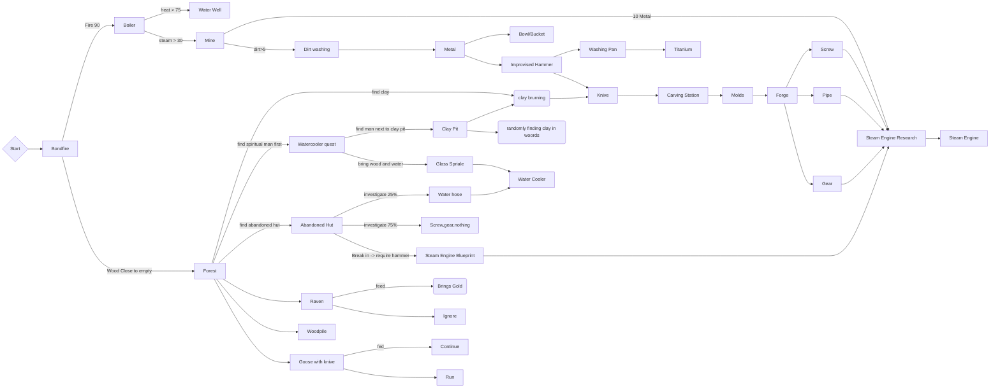

## Progression

```mermaid
flowchart LR
    S{Start}-->F[Bondfire]
    F-->|Fire 90|B[Boiler]
        B-->|heat > 75|WW[Water Well]
        B-->|steam > 30|MINE[Mine]
            MINE-->|10 Metal|ENGINE_QUEST[Steam Engine Research]
            MINE-->|dirt>5|DW[Dirt washing]
                DW-->Metal
                Metal-->Bowl/Bucket
                Metal-->IMPROV_HAMMER[Improvised Hammer]
                    IMPROV_HAMMER-->WP[Washing Pan]
                        WP-->Titanium
                    IMPROV_HAMMER-->Knive-->CS[Carving Station]
                        CS-->Molds-->Forge
                            Forge-->Screw
                            Forge-->Pipe
                            Forge-->Gear
                            ENGINE_QUEST-->ENGINE[Steam Engine]
                            Screw-->ENGINE_QUEST
                            Pipe-->ENGINE_QUEST
                            Gear-->ENGINE_QUEST
                        CB-->Knive
    F-->|Wood Close to empty|EXP[Forest]
        EXP-->|find clay|CB(clay brurning)
        EXP-->|find spiritual man first|WCQ[Watercooler quest]
            WCQ --> |find man next to clay pit|CP[Clay Pit]
                CP-->CB
                CP-->_(randomly finding clay in woords)
            WCQ --> |bring wood and water|GS[Glass Spriale]
        EXP-->|find abandoned hut|HUT[Abandoned Hut]
            HUT-->|investigate 25%|WH[Water hose]
            HUT-->|investigate 75%|Screw,gear,nothing
            HUT-->|Break in -> require hammer|ENGINE_BP[Steam Engine Blueprint]-->ENGINE_QUEST
        EXP-->Raven
            Raven-->|feed|BR_GOLD("Brings Gold")
            Raven-->Ignore
        EXP-->Woodpile
        EXP-->GOOSE[Goose with knive]
            GOOSE-->|fed|Continue
            GOOSE-->Run
        GS -->WC[Water Cooler]
        WH -->WC
```  